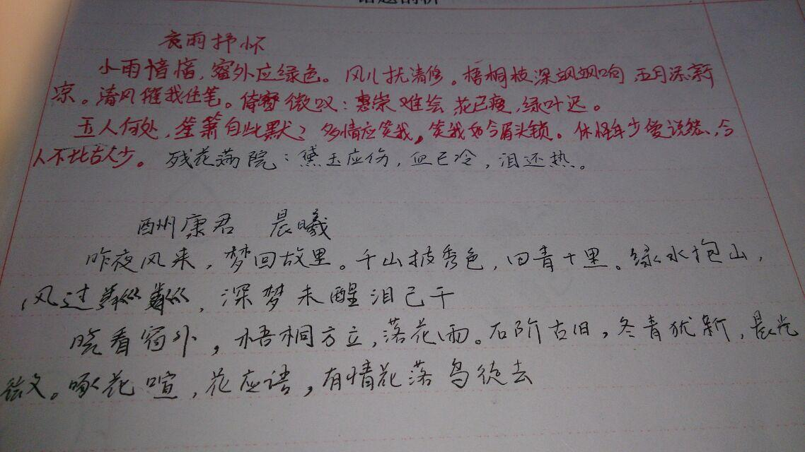

<!--@include: ../../../.vitepress/template/PostCommon.md-->

小雨yinyin，窗外应绿色。风儿扰清修。梧桐枝深飒飒响，五月添新凉。清风催我住笔。倚窗微叹：惠崇难绘，花已瘦，绿叶迟。

玉人何处，笙箫从此默。多情应笑我，笑我如今眉头锁。休怪年少爱说愁，今人不比古人少。[ 残花满院：黛玉应伤，血已冷，泪还热。]

酬康君 晨曦

半哥

昨夜风来，梦回故里。千山披秀色，回青千里。绿水抱山，风过粼粼，深梦未醒泪已干。

晓看窗外，梧桐方立，落花雨。石阶古泪，冬青犹新，晨光微，啄花喧，花应语，有情花落鸟徒去。

:::details 以下为原笔记旧图：

:::
