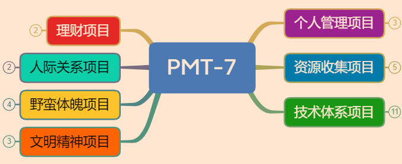

<!--@include: ../../../.vitepress/template/PostCommon.md-->

## 最初的探索：PMT-7 模型

### 介绍

PMT-7 近一年中，我积累沉淀出的适用于个人的个人管理，它是一种以个人高效管理为理念，系统管理个人相关数据的一套方案。其中三个字母代表的含义如下：

- P：Project 项目
- M：Module 模块
- T：Topic 主题

### 七大项目都有啥

7代表最外层的7大项目。

7大项目分别为 **技术体系项目（Green）**、**资源搜集项目（Blue）**、**文明精神项目（Orange）**、**野蛮体魄项目（Yellow）**、**个人数据管理项目（Purple）**、**理财项目（Red）**、**人际关系项目（Cyan）**，分别对应七彩色。

七大项目从不同的维度看：

- 从私密性与安全性看：数据管理项目、理财项目、人际关系项目是比较私人的，要注重个人数据安全；
- 从层级关系上看：资源搜集项目为其余六项的基础。它除了承载自己的资源搜集的功能外，还负责其余六个项目的重要数据存档；

### PMT-7 有什么用

这将为你构筑起你成长与优化的个人大厦，你需要做的是在骨架上不断筑垒自己的血肉。日复一日，年复一年，不断的进步与充实。

可以在自己的私人电脑上，建立一个文件夹，名叫 “`xx`”，其后分别建立七个文件夹，对应这七个项目。

其他功能还有很多，且去探索。

### 一些**组织形式**

思维导图、Excel 表格、图片、视频、音频、md 文章、txt 文本等。

## 七大项目简介

### **技术体系项目 G**

对于本项目，主要是纳含自己的技术栈体系。对我这个小小的 Java 后端开发程序员来说，通俗点讲就是掌握一些 Java 后端程序员的必备技能，有了这些技能才可以找到一份还不错的工作，维持生计。以此类比，对于别的行业，本项目就当然对应各自行业的技能了。在该项目之下，就要划分更具体的模块了。经过调研、思考与初步实践，我给自己总结了下大概有以下几个模块：

计算机基础模块、前端模块、后端模块、数据库模块、DevOps 模块、Toolchain 模块、个人网站模块、技术扩展模块、面试模块。

### **资源搜集项目 B**

最基础项目，它位于 PMT-7 基层。除了本身资源存档，还提供其他六项的物理存储方案。

搜集有意义的电影、电视剧、音乐、照片、小说等。软件包、重要文件等存档。将这些物理存储起来。

**主要操作模块**

- 图片模块：定期备份手机重要图片
- 音乐模块：收藏高品质、经典音乐
- 影视模块：经典电影、电视剧
- 软件包：软件安装包
- 重要文档存档：备份存档
- 资源之渔：公众号、网站等获取优秀资源、看剧神器等途径积累

**存储媒介**

- MBP 500G
- 雷蛇本 2T
- 移动硬盘 4T
- 云盘存储：百度网盘 & 阿里云盘 & 蓝奏云 & 坚果云

### 个人**管理项目 P**

主要是一些极客生活方式与个人数据的管理，例如

- 账号密码以及其他数据管理
- 软硬件使用习惯及技巧
- 断舍离：住所（租房）布置、个人物品管理等
- GTD——滴答清单

### **文明精神项目 O**

腹有诗书气自华，这句话很流行。谁不想自己谈吐举止高雅、精神思想深刻丰富呢？这一项目关注的更多的是精神层面的东西。包括但不限于：时事新闻、自己喜欢的书、视频、音乐等等。此外，玩游戏、旅游也算该部分。

- 阅读与读书笔记
- 随笔、个人诗选
- 短评、锐评、思想统治者风暴选
- 游戏
- 外出游玩，照片、文字游记，主要是照片。

### **野蛮体魄项目 Y**

- 健身
- 美食
- 规律作息
- 个人卫生

### **人际关系项目 C**

- 亲情
- 友情
- 爱情
- 萍水之情

### **理财项目 R**

你不理财，财不理你。